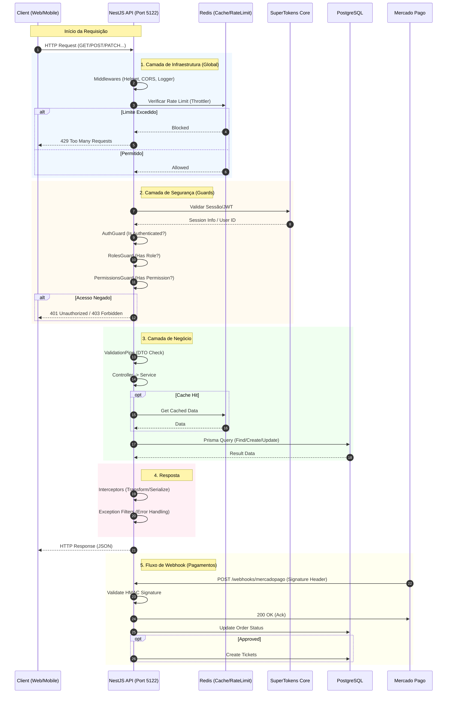

# Fluxo de Requisição e Rede da API

Este documento ilustra o fluxo de uma requisição HTTP através da infraestrutura do EventDev Server, detalhando as camadas de rede, segurança e persistência.

## Detalhes dos Componentes

| Componente | Porta Interna | Porta Exposta (Dev) | Função |
| :--- | :--- | :--- | :--- |
| **NestJS API** | 3000 | 5122 | Gateway principal, lógica de negócio, validação. |
| **SuperTokens** | 3567 | 3567 | Gerenciamento de sessões, tokens e identidade. |
| **Redis** | 6379 | 6379 | Rate limiting, cache de respostas e filas (futuro). |
| **PostgreSQL** | 5439 | 5432 | Persistência de dados relacional. |

## Fluxo de Rede (Docker)

No ambiente Docker (Dev e Prod), os serviços se comunicam através de uma rede interna (`eventdev-dev-network` ou `eventdev-prod-network`).

- A **API** acessa o banco via hostname `postgres-db`.
- A **API** acessa o cache via hostname `redis-cache`.
- A **API** acessa o auth via hostname `supertokens-auth`.
- O **Cliente** acessa a API via `localhost:5122` (Dev) ou `api.eventdev.org` (Prod).
